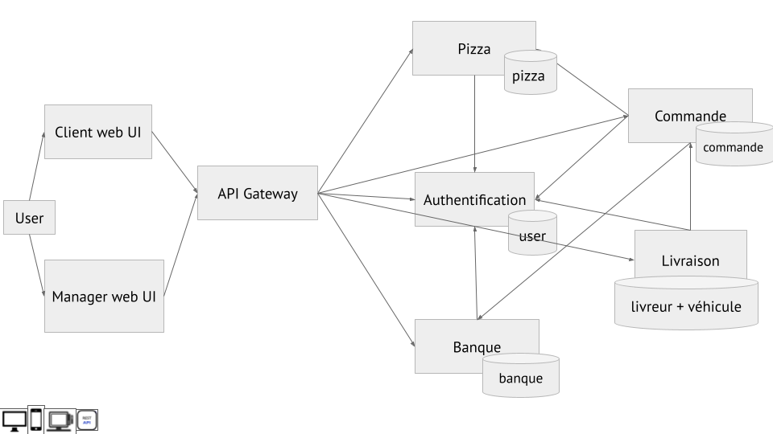

# PizzaFast

PizzaFast est un site fictif de pizzeria digitalisée 2.0 créé pour le cours d'architecture micro-services, fait en Angular, Node.js et MySQL.

- Eddy MONNOT
- Tristan LAUNÉ
- Samuel PRAK
- Mayur SONI

## Instructions

### Lancer l'application

Entrer la commande suivante pour démarrer l'application :
```bash
docker-compose up
```

Le site vitrine est accessible à l'adresse http://localhost:8082. L'administration est accessible à l'adresse http://localhost:8082/admin.

### Identifiants administrateur

Par défaut, les identifiants de connexion à l'interface d'administration sont `admin@pizzafast.fr` / `admin`.

### Utiliser l'application

- Se connecter d'abord sur l'interface d'administration à l'adresse http://localhost:8082/admin, avec les identifiants par défaut.
- Créer quelques ingrédients, puis une ou plusieurs pizzas.
- Se rendre ensuite sur le site vitrine à l'adresse http://localhost:8082/, s'inscrire, puis commander la pizza. Lorsque c'est demandé, recharger le compte bancaire avant de commander la pizza.
- La commande apparaît maintenant dans l'interface d'administration. Créer un livreur et un véhicule, et les assigner à la commande.

## Architecture

### Description des services

Notre application est décomposée en 8 micro-services back-end, front-end et API gateway.

**Back-end : Node.js / MySQL**

- Authentification : connexion et inscription des utilisateurs
- Pizza : gestion des pizzas et des ingrédients
- Commande : gestion des commandes des utilisateurs
- Banque : compte bancaire de l'utilisateur, vérification du solde
- Livraison : gestion des livreurs et véhicules, assigner un livreur et véhicule à une livraison

**Front-end : Angular**

- Site vitrine : permet à l'utilisateur de commander des pizzas
- Administration : permet à l'équipe de PizzaFast de gérer les commandes, livreurs, véhicules, pizzas et ingrédients

**API Gateway : nginx**

- API Gateway : permet d'accéder aux différents micro-services depuis le même service

### Schéma des services



### Communication entre services

Les différents services communiquent entre eux avec des APIs REST. La communication entre services est sécurisée si besoin avec une authentification basique, notamment pour la connexion entre le service Commande et le service Banque.

### Sécurité

Nous utilisons des tokens JWT pour authentifier l'utilisateur, sur le site vitrine et le back-office. Lors de sa connexion, le service Authentification génère un token JWT qui est enregistré côté client. Lorsque des requêtes sont faites vers un micro-service, celui-ci appelle le service Authentification avec le token fourni pour vérifier l'identité de l'utilisateur.

Pour l'administration, un champ `isAdmin` de l'utilisateur indique s'il est administrateur ou non. On utilise ce champ pour savoir s'il peut accéder ou non aux routes concernées par l'administration.

## Docker

### Format des fichiers Dockerfile

Les services back-end se basent sur l'image Docker `node:14`,  où l'on copie ensuite les fichiers de notre projet.

Les services front-end sont créés en deux étapes dans le Dockerfile, la première est le build du projet Angular (image `node:14`), et la seconde étape la mise en place du serveur web avec nginx (image `nginx:alpine`).

### Volumes

Tous les containers correspondant à une base de données MySQL nécessitent un volume, que l'on définit dans le `docker-compose.yml`. En plus des bases de données, le service `pizza` a besoin d'un volume pour le stockage des images des pizzas et des ingrédients.

### Fichier docker-compose.yml

Le fichier `docker-compose.yml` regroupe l'ensemble de nos 13 containers et permet le déploiement simple du projet.

### API Gateway

Nous utilisons nginx pour créer notre API Gateway et regrouper les requêtes sur un seul service.

- `/` : Site vitrine
- `/admin` : Back-office du site
- `/auth` : API Authentification
- `/pizza` : API Pizza
- `/order `: API Commande
- `/delivery` : API Livraison
- `/bank` : API Banque

## Ce qui a été ajouté depuis la présentation

Depuis la présentation, nous avons ajouté plusieurs points :

- Les services appellent maintenant le service d'authentification à chaque requête. Cela permet de vérifier le token JWT fourni par le client, et ainsi de vérifier qu'il est bien authentifié.
- API Gateway : nous avons ajouté un nouveau service nginx permettant de regrouper les requêtes sur un seul service, permettant de rassembler les services sur un même domaine / port.
- Authentification admin : nous avons rajouté une colonne `isAdmin` dans la table utilisateurs pour permettre la connexion à l'interface administration. On vérifie ensuite auprès du service authentification que l'utilisateur a bien cette permission pour les routes admin.